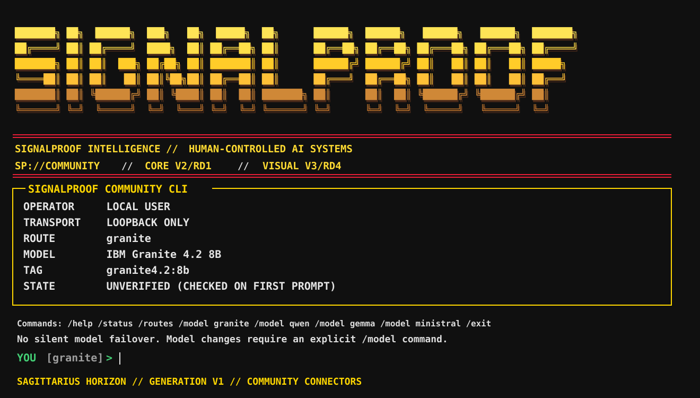

# Signalproof Intelligence

Signalproof Intelligence is the public repository for governed intelligence systems, tools, models-as-connections, and human-controlled infrastructure.

This repository is **public-safe by construction**. It does not inherit private Signalproof routes, credentials, customer state, internal evidence, training state, or operator-machine paths.

## Community CLI

Stable repository path:

```text
community-cli/
```

Stable command:

```text
signalproof-community
```

Current public connector targets:

- IBM Granite 4.2 8B
- Qwen 3.6
- Google Gemma 4
- Mistral AI Ministral 3 3B

**Models are not included.** Signalproof Intelligence does not download, bundle, mirror, host, install, or redistribute their weights. The CLI only checks for and connects to exact local model tags already installed by the user.

See [community-cli/README.md](community-cli/README.md).

## CLI visual identity

The Community CLI uses the approved Signalproof terminal language reflected on the Signalproof Intelligence site:

- gold/yellow six-row wordmark;
- red separator rules;
- Signalproof Intelligence / Human-Controlled AI Systems header;
- `SP://COMMUNITY` plane;
- V2/RD1 community core identity with V3/RD4 visual identity;
- thin gold status frame with the title embedded in its top border;
- green `YOU [model] >` prompt;
- Sagittarius Horizon generation line.



## Public boundary

Read [PUBLIC-BOUNDARY.md](PUBLIC-BOUNDARY.md) before contributing.

Never publish:

- private Signalproof servers/workers or route IDs;
- SSH identities, keys, secrets, tokens, or credentials;
- tenant/customer configuration or data;
- internal Build Ledger or evidence;
- private model-training checkpoints/state;
- developer workstation paths;
- private network topology;
- implicit access to private infrastructure.

## Security and governance

- Apache License 2.0 applies to Signalproof-authored code/documentation unless a file states otherwise.
- Third-party software and model weights retain their own upstream terms.
- Public sanitization runs in CI.
- Community CLI tests cover supported Python versions and desktop OSes.
- CODEOWNERS requests owner review for repository changes.
- Model connectors are loopback-only and advisory-only.
- No silent model fallback.
- No model install/download authority.
- No model weights in this repository.

See [SECURITY.md](SECURITY.md), [CONTRIBUTING.md](CONTRIBUTING.md), and [THIRD-PARTY-NOTICES.md](THIRD-PARTY-NOTICES.md).

## Identity

Current migration candidate: **Community CLI V2/RD1**  
Visual contract: **V3/RD4**  
Current generation: **Sagittarius Horizon**

Product: https://signalproofintelligence.com  
Framework: https://signalproof.com

Copyright 2026 Doc Reo / Signalproof Intelligence.
